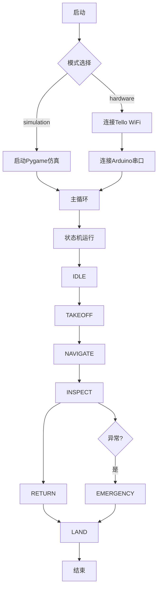

# 软件架构文档

## 一、模块依赖图

```
main.py (主调度 — 有限状态机)
    ├── drone/
    │   ├── tello_basic.py      ← djitellopy
    │   ├── tello_video.py
    │   └── tello_state.py
    ├── arm/
    │   ├── arm_kinematics.py   ← numpy, scipy
    │   └── arm_controller.py   ← pyserial
    ├── core/
    │   ├── disturbance_observer.py (12维EKF) ← numpy
    │   ├── feedforward_controller.py (PID+FF) ← numpy
    │   └── trajectory_planning.py (RRT*) ← numpy, scipy
    ├── vision/
    │   ├── detect.py           ← ultralytics (YOLOv8)
    │   ├── train.py
    │   └── dataset_utils.py
    ├── simulation/             ← pygame, numpy
    │   ├── models.py
    │   ├── renderer.py
    │   └── simulation.py
    ├── utils/
    │   ├── config.py           ← yaml
    │   ├── logger.py
    │   └── communication.py    ← queue, threading
    ├── safety_guard.py
    └── frontend/
        └── dashboard.py        ← tkinter, PIL

firmware/
    └── servo_controller/       ← Arduino C++
        └── servo_controller.ino
```

## 二、运行流程



## 三、数据流

```
Tello IMU ──→ EKF ──→ 扰动估计 ──→ 控制器 ──→ 速度指令 ──→ Tello
                ↑                                          │
光流/气压 ──────┘                                    机械臂指令 ──→ Arduino
                                                        ↑
                                                       目标位置
                                                        ↑
                                                    路径规划 (RRT*)
                                                        ↑
                                                    巡检目标点
                                                        ↑
                                                     视觉检测 (YOLO)
```

## 四、配置文件说明

```
config/
├── drone_config.yaml     # 控制器参数、EKF参数、Tello设置
├── arm_config.yaml       # 机械臂连杆长度、关节限制
└── yolo_config.yaml      # 检测阈值、模型路径、类别名
```

配置热加载: 修改YAML后无需重启，主循环定期重新加载。

## 五、安装依赖

```bash
pip install -r requirements.txt
```

主要依赖:
- numpy, scipy — 数学计算
- pygame — 仿真可视化
- ultralytics — YOLOv8
- pyserial — Arduino通信
- pyyaml — 配置解析

## 六、快速开始

```bash
# 1. 克隆项目
git clone <repo-url>
cd offshore-wind-uav-arm

# 2. 安装依赖
pip install -r requirements.txt

# 3. 仿真模式测试
python backend/main.py --mode simulation --target "10,0,20"

# 4. 真机模式
python backend/main.py --mode hardware --target "10,0,20"

# 5. 运行测试
bash scripts/run_tests.sh
```
